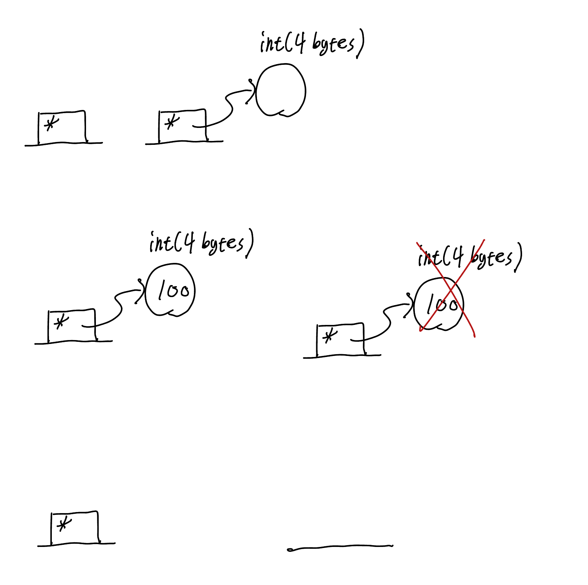

# Memory Structure

> high level, low level 메모리 모델에서 데이터가 어떻게 저장되는지
> 
> Data가 Stack과 Heap에 저장되는 이유
> 
> 메모리 leak
> 
> 메모리 leak 방지 방법


## 1. Variables in Memory

> Stack

- 컴퓨터는 위에서 몇번째 떨어져 있는지를 기준으로 변수가 어디 저장됐는지 찾음

```cpp
int main()
{
    int a = 0;
    int b = 3;
    int c = a+b;
    double d = 2.5;
}
```


<br>
<br>

## 2. Variable Types 1

- 각 타입은 타입에 맞는 메모리 공간을 차지한다.

https://en.cppreference.com/w/cpp/language/types

https://en.cppreference.com/w/cpp/types/integer

<br>
<br>

## 3. Variable Types 2

> Struct, Class

### Struct
- 내부 변수에 따라 크기 결정
- Memory Access 패턴 때문에 Compiler가 사이에 패딩을 넣어줘 크기가 커질 수 있다.

### Class
- 내부 변수에 따라 크기 결정

### Pointer
- 64비트 환경에서 주소를 가리키기위해서 8바이트 크기를 갖음

<br>
<br>

## 4. Stack Frame
- 메모리는 Stack Frame 단위로 쌓아감, Stack Frame은 fuction 단위로 나뉘어 진다.
- argument 정보, return address 정보 들도 포함된다.

```cpp
void foo()
{
    int a;
    int b;
};

class Cat
{ 

};

class Dog
{ 

};

void bar() 
{
    Cat cat;
    Dog dog;
};

int main()
{
    int a;
    double b;

    foo();
    bar();

    return 0;
}
```


```cpp
class Cat
{
    public:
        Cat() 
        { 
            m_age = 1;
        };
        ~Cat();
        void addAge(int arg)
        {
            m_age += arg;
        };
    private:
        int m_age;
};

int main()
{
    Cat cat;
    cat.addAge(10);

    return 0;
}
```

> this: 현제 object의 address를 가리키는 키워드
> this를 사용해 member variable을 controll한다.


<br>
<br>

## 5. Heap Intro

> CPP 는 unmanaged language라 memory leak, memory fragmentation 발생할 수 있다.


### Stack vs Heap

> Heap 메모리를 관리하기 위해 Stack에 Pointer(주소 정보를) 두고 Heap 메모리에 접근한다.

- Stack


- Heap


<br>

```cpp
int main() 
{
    int * ip;
    ip = new int;
    *ip = 100;
    delete ip;

    return 0;
}
```



<br>

### Heap Memeory를 사용하는 이유

1. Life Cycle
    Stack에서는 Stack Frame 단위로 Memory에서 data가 해제되고 할당돼 data는 Heap에 저장하고 Pointer를 Stack영역에서 관리하도록해 life cycle 문제 해결

2. Large Size
    Stack에는 한계가 있어 stack에는 Pointer를 놓고 Heap에 큰 크기의 data를 저장해 접근
    
3. Dynamic (runtime)
    Stack Frame은 compile time에 결정됨, run time에 결정되는 것은 Heap에 저장

<br>
<br>

## 6. Heap Code

### C Style

- C Style로 작성시 constructor, destructor 호출되지 않음
- C style로 객체를 만들면 안됨, malloc 사용 지양
- malloc, free -> new, delete 로 치환해 사용하면 constructor, destructor 호출됨

```c
int main() { 
    // C style heap Cat
    Cat * catp = (Cat *)malloc(sizeof(Cat));
    free(catp);

    // C style heap Cats(Cat array)
    Cat * catap = (Cat *)malloc(sizeof(Cat)*5);
    free(catap);

    // C style heap int
    int * ip = (int *)malloc(sizeof(int));
    * ip = 100;
    free(ip);

    // C Style heap array
    int * iap = (int *)malloc(sizeof(int)*5);
    iap[0]=100;
    free(iap);
}
```

<br>

### C++ Style
- delete를 까먹으면 destructor가 호출되지 않아 memory leak이 발생할 수 있다.

```Cpp
int main() { 
    // C++ style heap Cat
    Cat * catp = new Cat;
    delete catp;

    // C++ style heap Cats(Cat array)
    Cat * catap = new Cat[5];
    delete [] catap;

    // C++ style heap int
    int * ip = new int;
    *ip = 100;
    delete ip;

    // C++ Style heap array
    int * iap = new int[5];
    delete [] iap;
}
```

### Safer C++ Style
- smart pointer 사용
- array는 vector를 사용

```Cpp
int main() { 
    // Safer C++ style heap
    std::unique_ptr<Cat> catp = std::make_unique<Cat>();
    std::vector<Cat> cats(5);
}
```

<br>

### Dynamic Allocation

```Cpp 
int main() { 
    std::cout<< "How many cats do u need?" << std::endl;
    int catCount;
    std::cin >> catCount;
    std::vector<Cat> cats(catCount); 
}
```


compile time에 vector object를 stack에 쌓아 놓고 Cat을 run time에 입력받은 만큼 생성한다.

<br>
<br>

## 7. Heap In Process
### Memory Leak
- 언제 멈출지 모른다.
- Valgrind tool 사용해 leak 감지
- top 명령어 사용해 터미널에서 현제 프로세스 정보 모니터링 가능
  
<br>

```cpp
#include <iostream>

int main()
{
    int sa = 0;
    int sb = 1;

    std::cout << "&sa : " << (long)&sa << std::endl;
    std::cout << "&sb : " << (long)&sb << std::endl; 

    int * hap = new int;
    int * hbp = new int;

    std::cout << "&hap : " << (long)&hap << std::endl;
    std::cout << "&hbp : " << (long)&hbp << std::endl;

    std::cout << "&ha : " << (long)hap << std::endl;
    std::cout << "&hb : " << (long)hbp << std::endl;

    // Prefer Smart Pointer
    delete hap;
    delete hbp;
    
    return 0;
}

/* 
**GCC Compiler**

&sa : 6127710200
&sb : 6127710196
&hap : 6127710184
&hbp : 6127710176

&ha : 4812988608
&hb : 4812988624
*/

/*
**clang Compiler**

&sa : 6128463864
&sb : 6128463860
&hap : 6128463848
&hbp : 6128463840

&ha : 4796211392
&hb : 4796211408
*/
```


- Heap 메모리는 Stack 영역보다 덜 빡빡하게 들어감(Memory Allocator 마음)

