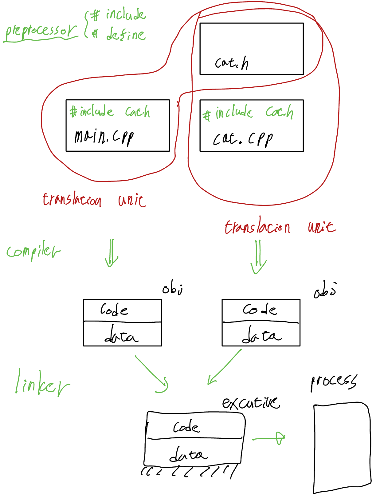

# Compile Process

 

## Introduction

### Build Process

- C++
  - header
  - Cpp

- Library
  - header only
  - static
  - dynamic

- assembler
- compilation
- linker

- [list of compiler](https://en.wikipedia.org/wiki/List_of_compilers)

### Compile Option
> [GCC compilation options](https://gcc.gnu.org/onlinedocs/gcc/Option-Summary.html)

- -o 'name'
- -Wall
- -Werror
- -std=c++17
- -g
- -v
- -O
  - [GCC optimization levels](https://gcc.gnu.org/onlinedocs/gcc/Optimize-Options.html) 

 
 

## Header File

