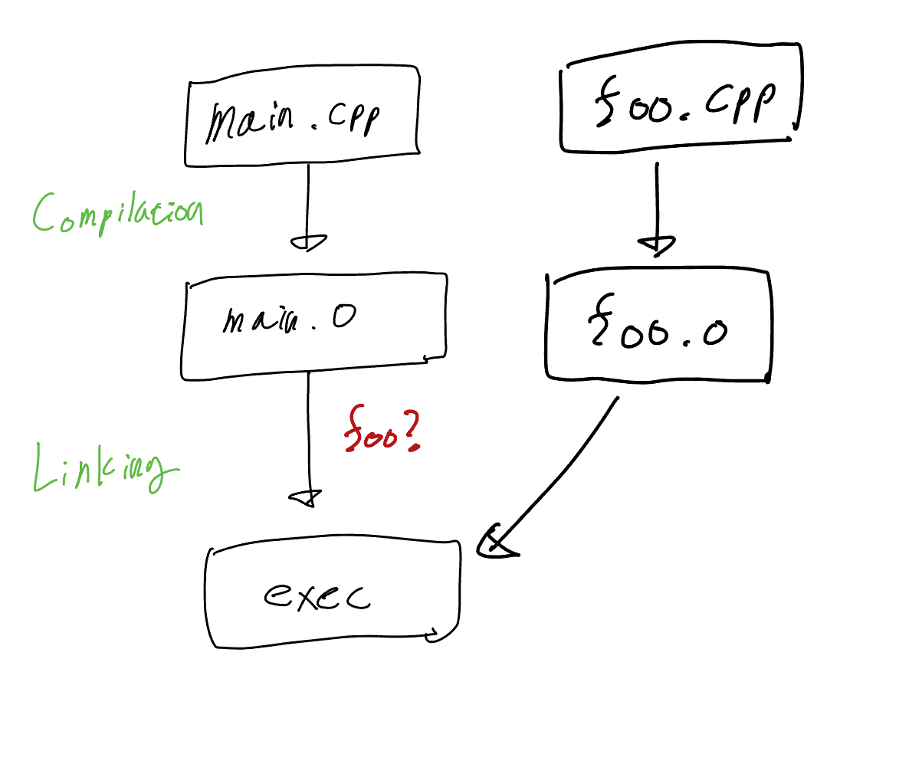
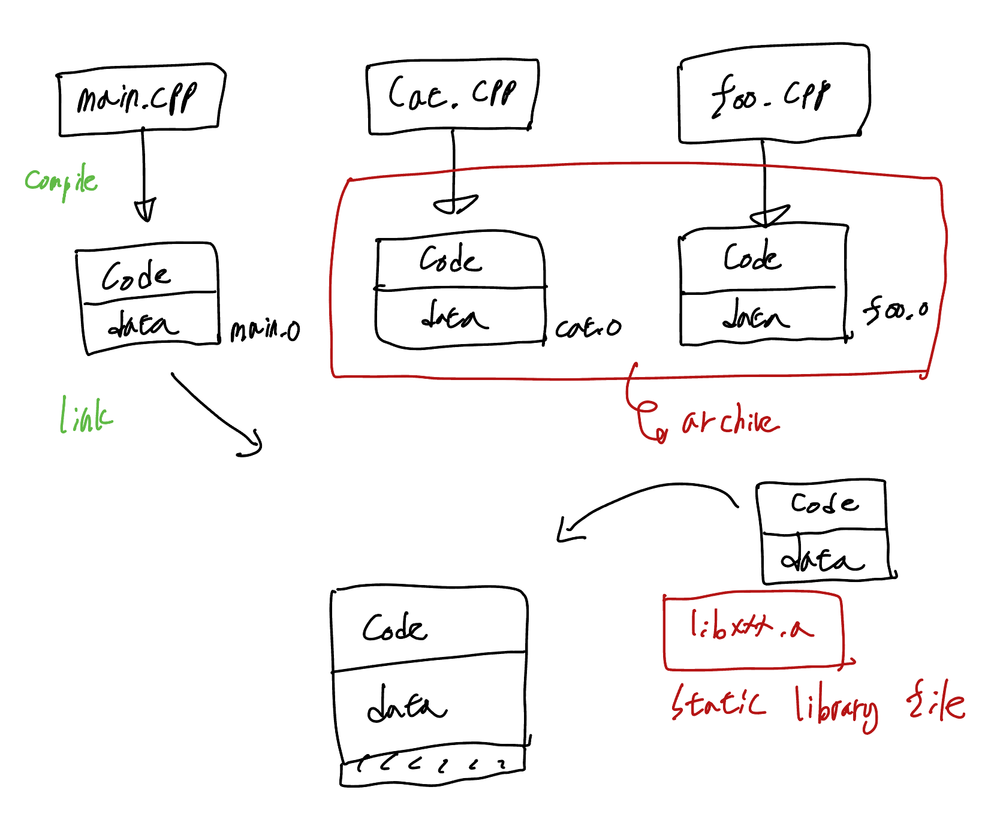

# Compile Process

<br>

## Introduction

### Build Process

- C++
  - header
  - Cpp

- Library
  - header only
  - static
  - dynamic

- assembler
- compilation
- linker


- [list of compiler](https://en.wikipedia.org/wiki/List_of_compilers)

### Compile Option
> [GCC compilation options](https://gcc.gnu.org/onlinedocs/gcc/Option-Summary.html)

- -o 'name'
- -Wall
- -Werror
- -std=c++17
- -g
- -v
- -O
  - [GCC optimization levels](https://gcc.gnu.org/onlinedocs/gcc/Optimize-Options.html) 

<br>
<br>

## Header File

### 1. Compilation Error

```Cpp
/* 
main.cpp 
*/
int main()
{
    foo();
    return 0;
}
```

- foo 함수가 정의되지 않아 compile 오류 발생

```
main.cpp:7:5: error: use of undeclared identifier 'foo'
    foo();
    ^
1 error generated.
```

<br>

### 2.  Linking Error

```Cpp
/* 
main.cpp 
*/

void foo() // definition

int main()
{
    foo();
    return 0;
}
```

```Cpp
/* 
foo.cpp 
*/
#include <iostream>

void foo() // implementation
{
    std::cout << "foo" << std::endl;
}
```

- 컴파일 성공후 실행 파일을 만드는 과정(linking)에서 foo의 실행부를 찾을 수 없어 실패
  
```
Undefined symbols for architecture arm64:
  "foo()", referenced from:
      _main in main-80f16b.o
ld: symbol(s) not found for architecture arm64
clang: error: linker command failed with exit code 1 (use -v to see invocation)
```


<br>

- c 옵션으로 objective 파일 만듦

```
g++ main.cpp -c -Wall -Werror
```

- S 옵션으로 assembly 파일 만듦

```
g++ main.cpp -S -Wall -Werror
```

<br>

### 3. main.o 와 foo.o 파일들을 linking 처리


```Cpp
/* 
main.cpp 
*/

void foo() // definition

int main()
{
    foo();
    return 0;
}
```

```Cpp
/* 
foo.cpp 
*/
#include <iostream>

void foo() // definition

void foo() // implementation
{
    std::cout << "foo" << std::endl;
}
```

<br>

> g++ main.cpp -c -Wall -Werror  
> g++ foo.cpp -c -Wall -Werror  
> g++ main.o foo.o -o foo -Wall -Werror 




<br>

### 4. declaration 부분을 header 파일로 이동

```Cpp
/* 
foo.h
*/

void foo() // definition
```

```Cpp
/* 
main.cpp 
*/
#include "foo.h"

int main()
{
    foo();
    return 0;
}
```

```Cpp
/* 
foo.cpp 
*/
#include "foo.h"
#include <iostream>

void foo() // implementation
{
    std::cout << "foo" << std::endl;
}
```


<br>

### 5. class로 확장

```cpp
/*
cat.h
*/
#pragma  once

class Cat
{
    public:
        void speak();
};
```

```cpp
/*
cat.cpp
*/
#include <iostream> // standard library
#include "cat.h"    // user specific header

void Cat::speak()
{
    std::cout<< "meow" << std::endl;
}
```

```cpp
/*
main.cpp
*/
#include "cat.h"

int main()
{
    Cat kitty;
    kitty.speak();
    return 0;
} 
```


- header file을 가져와 translation unit을 만들어 독립적인 build process를 구성할 수 있음
- 보통 객체 선언 파트는 header 파일에 넣어주고 definition 파일은 cpp 파일에 넣어준다.

<br>
<br>

## Preprocessor

> [cpp preprocessor reference](https://en.cppreference.com/w/cpp/preprocessor)

```cpp
#include <iostream> // standard library
#include "cat.h"    // user specific header
```

### header 중복 선언 방지

1. #ifndef, #define preprocessor 사용
   
```cpp
#ifndef CAT_H
#define CAT_H
Class Cat
{
    public:
        void speak();
};
#endif
```

2. #pragma preprocessor 사용

```cpp
#pragma once
Class Cat
{
    public:
        void speak();
};
```

<br>
<br>

## Extern, Static 

> Build Process 중 Linking Process 와 관련
> [extern, static cpp reference](https://en.cppreference.com/w/cpp/language/storage_duration)

- Extern: 바깥쪽에서 link를 찾아라
- Static: 안쪽으로만 link를 열어라

<br>

- 함수는 extern이 default 값이다.
- class 에서도 가능하다면 private 보다 static을 사용하는게 더 안전하게 구성 가능

### extern "C"

- 함수 overloading 때문에 발생하는 name magling을 방지하기위해 extern "C" 사용한다.

- nm 명령어 사용해 object 파일의 symbol들 확인 가능
```
nm foo.o
```

<br>
<br>

## Assembly

1. Compiler C++ optimization 확인
2. CPU Architecture 마다 생성되는 machine code 확인

<br>

- S 옵션으로 assembly 파일 생성

```
g++ assembly.cpp -S
```

- [compiler explorer C++](https://godbolt.org/)

<br>
<br>

## Debug

- g 옵션으로 디버그 모드로 컴파일
```
g++ main.cpp -Wall -Werror -g
```

<br>

- [gcc g option](https://gcc.gnu.org/onlinedocs/gcc/Debugging-Options.html)

<br>

- 디버그 모드를 통해 확인할 수 있는 것
  - Variable 
  - Break Pointer
  - Call Stack(Back Trace)

<br>
<br>

## Static Library

### Library

> [cpp reference standard library](https://en.cppreference.com/w/cpp/header)

- Header Only Library: #include "header"를 통해 사용
- Static Library: .lib(윈도우), .a(리눅스) / build process에서 라이브러리를 link 시킨다.
- Dynamic Librar:
  - load time: processor를 실행 시킬때 라이브러리 바인딩
  - run time: processor가 실행 중 라이브러리 바인딩
  - .dll(윈도우), .so(리눅스)


### Static Library

> object 파일들을 모은 파일



1. object file 생성
```
g++ cat.cpp -c 02 -Wall -Werror
```

2. objectg file .a 파일(스태틱 라이브러리)로 변환
```
ar -rs libcat.a cat.o
```
> [linux ar](https://linux.die.net/man/1/ar)

3. 라이브러리 파일로 링크
```
g++ main.cpp -L. -lcat
```

<br>
<br>

## Dynamic(shared) Library
> load time or run time 에 라이브러리가 바인딩 된다.


