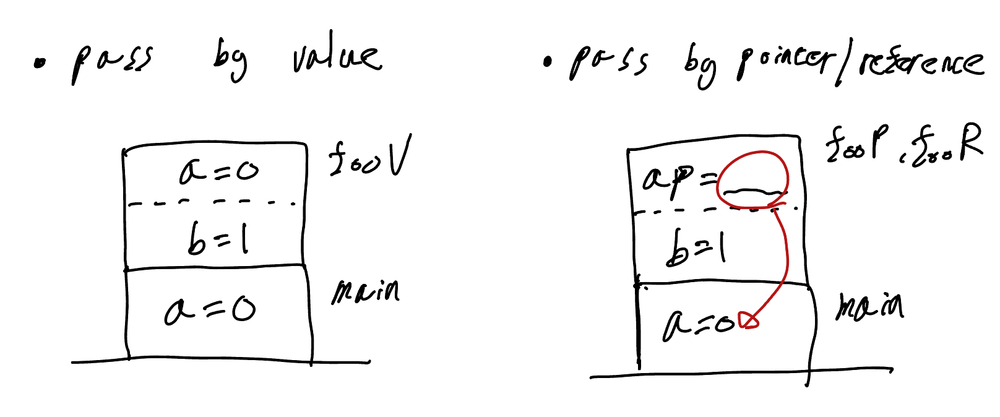
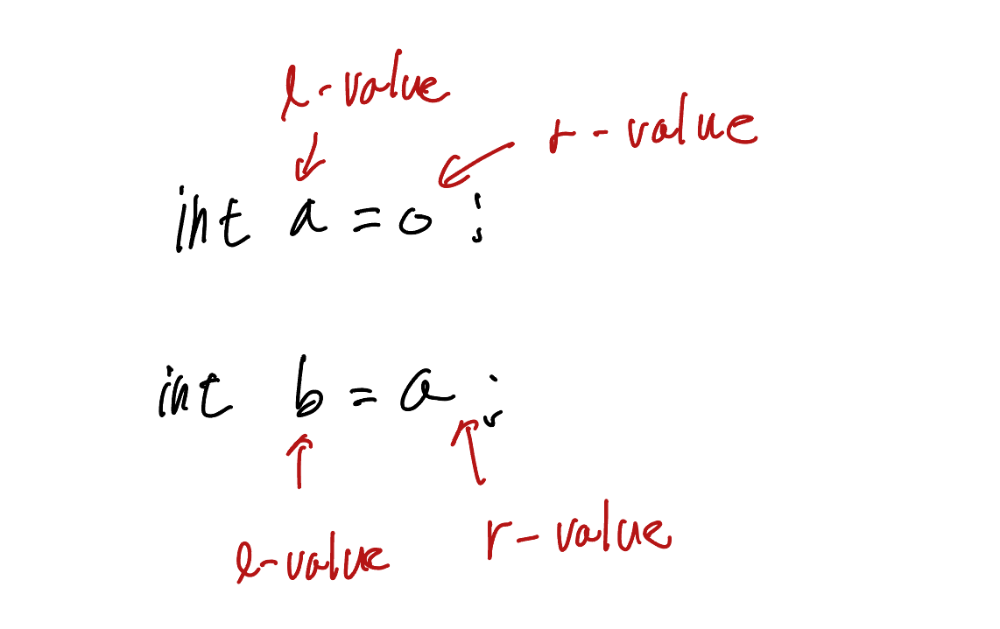
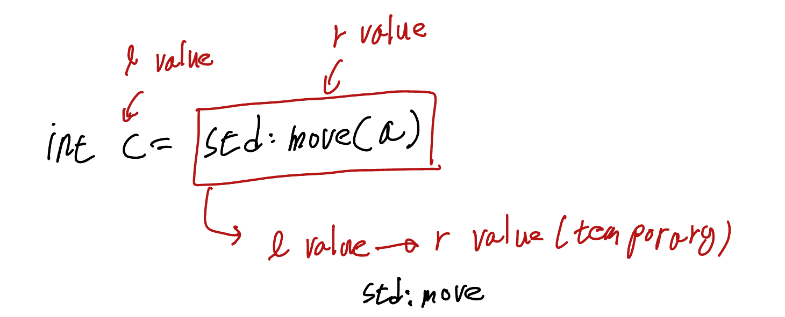
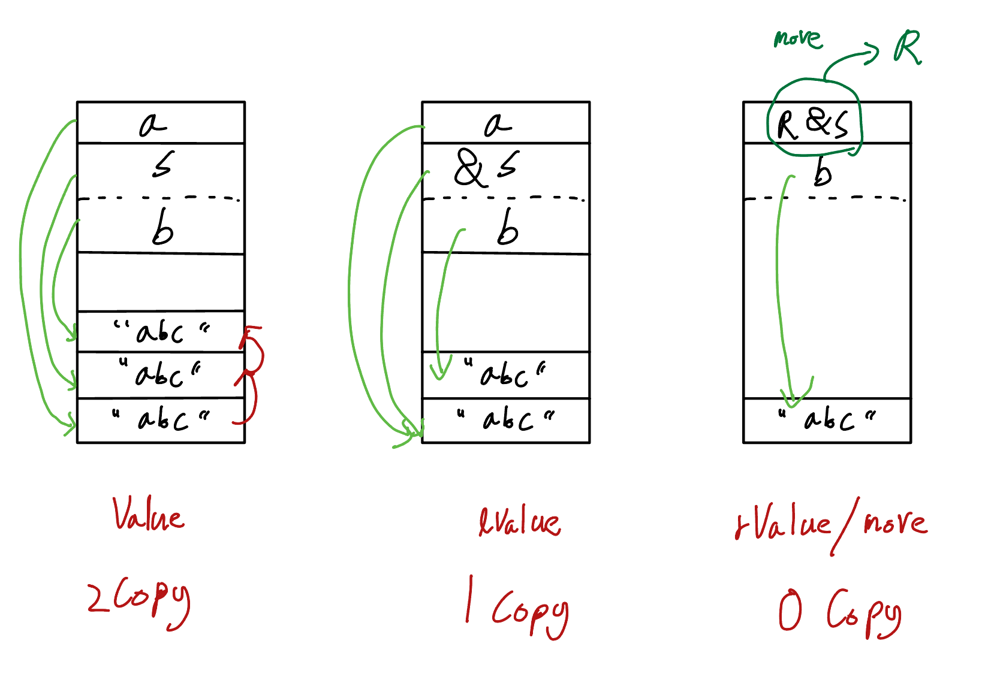
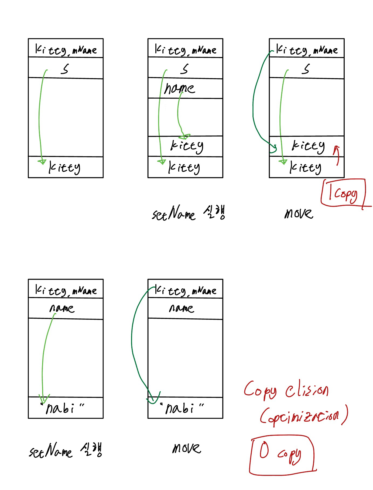
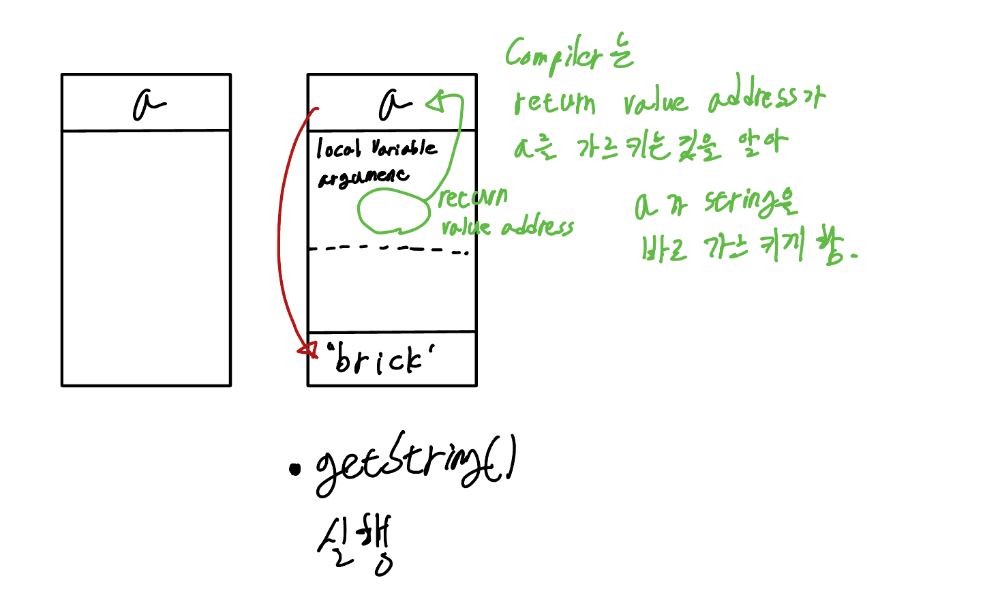

# Resource Move

<br>

## 1. Pointer VS Reference

- pass by value
- pass by pointer
- pass by reference

```cpp
void fooV(int a)
{ 
    int b = a+1;
};

void fooP(int * ap)
{
    int b = *ap+1;
}

void fooR(int & a)
{ 
    int b = a+1;
};

void fooR(const int & a)
{ 
    int b = a+1;
};

int main()
{
    int a = 0;
    fooV(a);
    fooP(&a);
    fooR(a);

    return 0;
}
```

<br>



<br>

- pass by value로 큰 크기의 data를 넘겨 주면 stack 영역에 너무 큰 영역을 차지하게된다. 따라서 큰 크기의 data를 넘겨줄 때는 pass by reference/pointer를 사용해 참조를 넘겨주는게 효율적인 방법이다.

<br>
<br>

## 2. L-Value VS R-Value



- L-Value(&)
한번 호출 후 다시 호출할 수 있다

- R-Value(&&)
한번 호출 후 다시 호출할 수 없다.

- std::move



```cpp
#include <string>

void storeByValue(std::string s)
{
    std::string b = s;
};

void storeByLRef(std::string & s)
{
    std::string b = s;
};

void storeByRRef(std::string && s)
{
    std::string b = std::move(s);
};

int main()
{
    std::string a = "abd";
    storeByValue(a);
    storeByLRef(a);
    storeByRRef("abd");
}
```

<br>



<br>
<br>

## 3. std::move()

> resource ownership을 다른 object에게 넘겨준다. 

```cpp
#include <iostream>
#include <string>

int main()
{
    std::string a = "brick";
    std::cout << "a:" << a << std::endl;

    std::string b = std::move(a);
    std::cout << "b:" << b << std::endl;
    std::cout << "a:" << a << std::endl;
};

/*
a:brick
b:brick
a:
*/
```

```cpp
void storeByLRef(const std::string & s)
{
    std::string b = std::move(s)
    // copy
    std::cout << "b:" << b << std::endl;
};
```

- const를 사용하면 s를 유지할 수 있지만 copy가 발생한다.

<br>

```cpp
#include <string>
#include <iostream>

class Cat
{
public:
    void setName(std::string name)
    {
        mName = std::move(name);
    };
private:
    std::string mName;
};

int main()
{
    Cat kitty;
    std::string s = "kitty";

    kitty.setName(s);        // 1 copy
    kitty.setName("nabi");   // 0 copy
}
```



- lValue - 1 copy
- rValue - 0 copy

<br>
<br>

## 4. RVO(Return Value Optimization)

> 함수 리턴 최적화

```cpp
#include <string>

std::string getString()
{
    std::string s = "brick";
    return s; // RVO
}

int main()
{
    std::string a = getString();
    return 0;
}
```



- RVO가 개입해 s는 처음부터 존재하지도 않음
- RVO가 개입해 0 copy 
- RVO가 개입해 소유권의 이동도 발생하지 않음
- 대부분 RVO가 개입하지만 RVO가 개입하지 않는 경우에도 일반적으로 0 copy가 돼 굳이 return 시 std::move 를 사용하지 않아도된다.
- [cppreference copy elision](https://en.cppreference.com/w/cpp/language/copy_elision)
