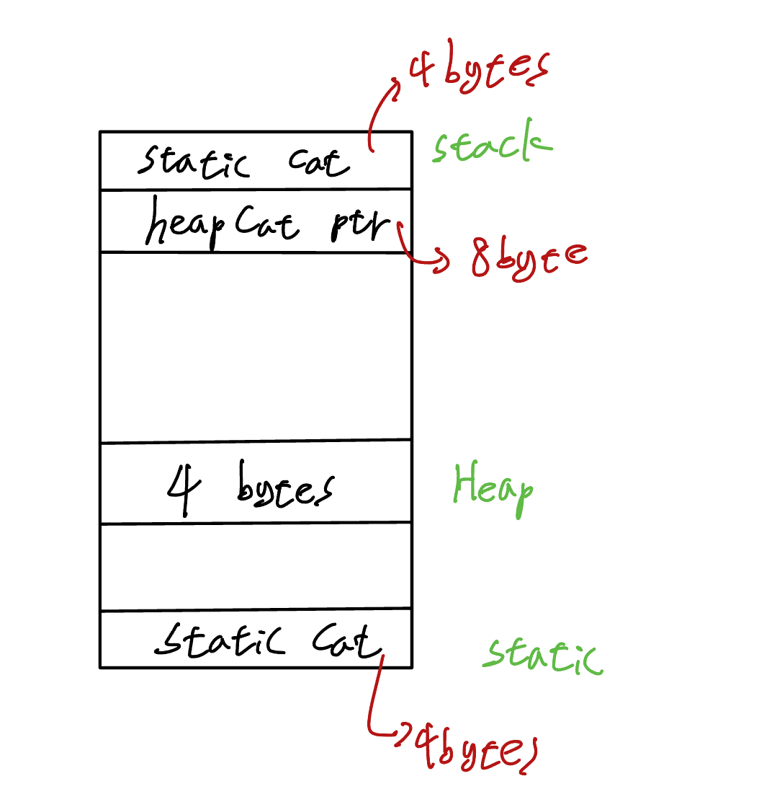
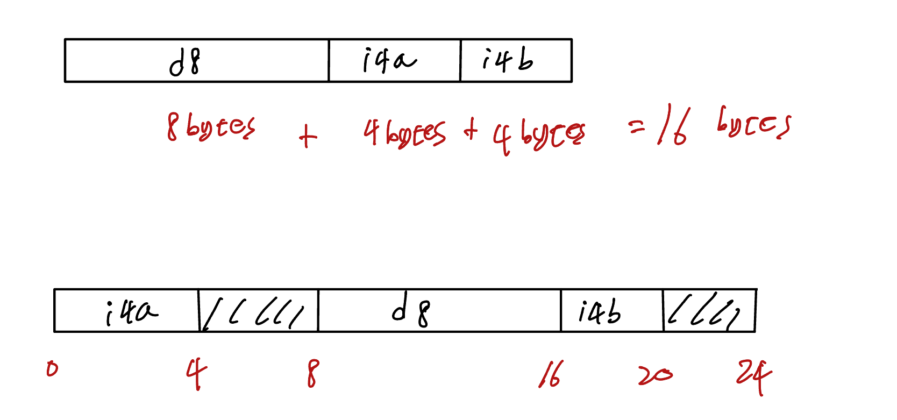
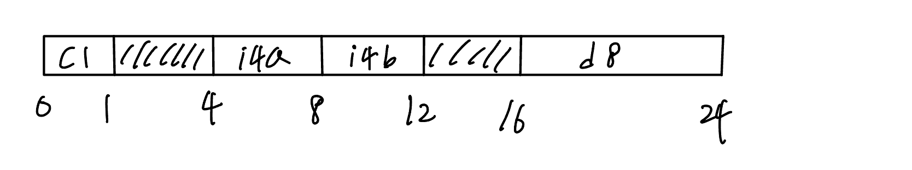
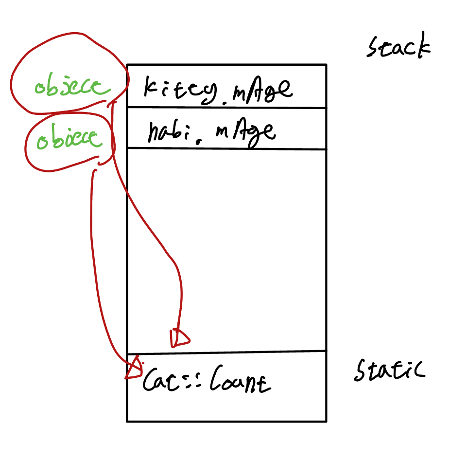
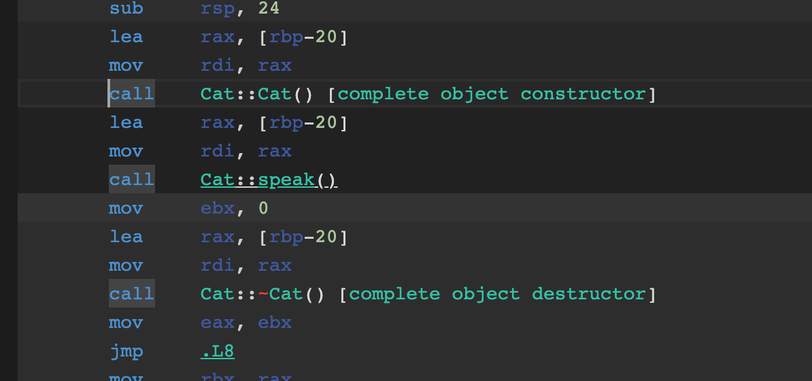
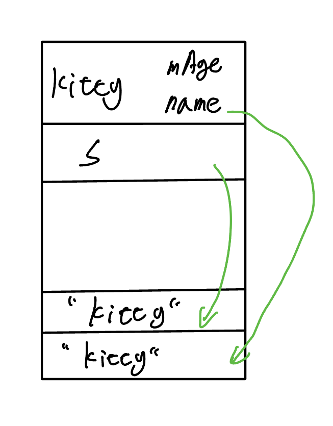
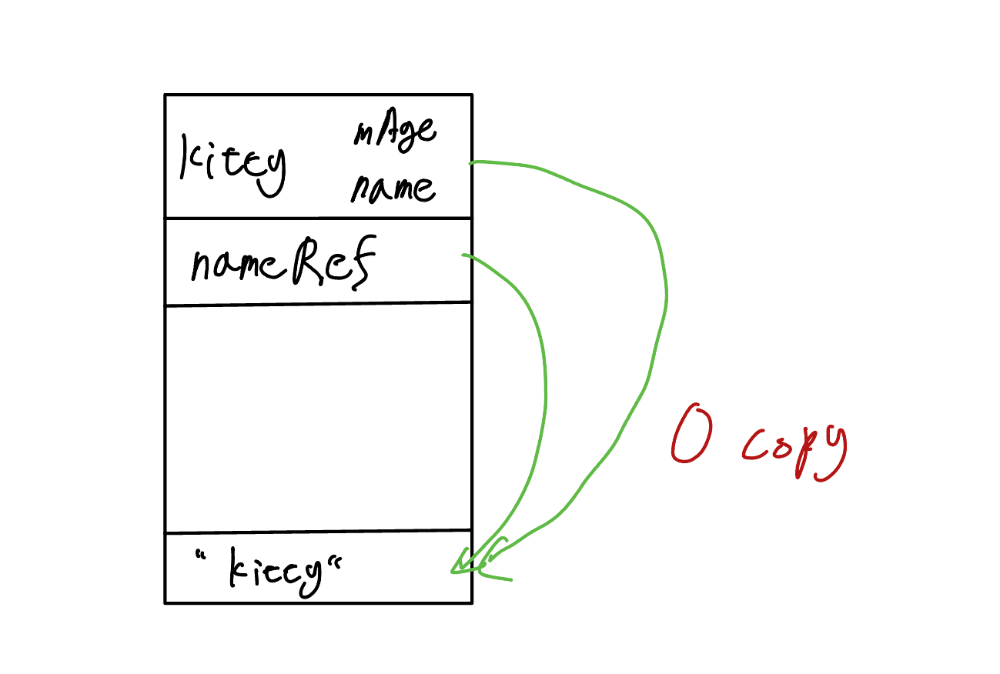

# OOP

<br>

## 1. OOP Intro

### C++ multi paradigm
- procedural
- functional
- OOP
- generic

<br>

### OOP
- Abstraction
- Encapsulation
- Inheritance
- Polymorphism
  - funcion overloading (static)
  - function overriding (dynamic)

<br>
<br>

## 2. Object Alignment

```cpp
#include <iostream>

class Cat
{
public: 
  void speak();
private:
  int mAge;
};

Cat staticCat;

int main()
{
  std::cout << sizeof(Cat) << std::endl;
  // 4
  Cat stackCat;

  Cat * heapCatPtr = new Cat();
  delete heapCatPtr;
  // prefer smartPtr

  return 0;
}
```



<br>

### memory alignmnet rule
- member variable은 그 size의 배수의 위치에서 시작해야한다.
- object의 전체 size는 가장 큰 member variable size의 배수에서 끝나야한다.

<br>

```cpp
class Cat
{
public: 
  void speak();
private:
  double d8;  // 8bytes
  int i4a;    // 4bytes
  int i4b;    // 4bytes
  /*
  16bytes
  */
};
```

```cpp
class Cat
{
public: 
  void speak();
private:
  int i4a;    // 4bytes
  double d8;  // 8bytes
  int i4b;    // 4bytes
  /*
  24bytes
  */
};
```



<br>

```cpp
class Cat
{
public: 
  void speak();
private:
  char c1;    // 1byte
  int i4a;    // 4bytes
  int i4b;    // 4bytes
  double d8;  // 8bytes
};
```



### False Sharing
- parallel programming 시 Cashe Line 라는 hardware적 구조에 따라 data가 64bytes 단위로 잘라지고 한 블락이 각각 갈라져 다른 core로 들어가는 상황
- alignas 키워드를 사용해 방지한다.
- [alignas🔗](https://en.cppreference.com/w/cpp/language/alignas)

```cpp
class alignas(32) Cat // <-- 32bytes로 변환해 false sharing 방지
{
public: 
  void speak();
private:
  char c1;    // 1byte
  int i4a;    // 4bytes
  int i4b;    // 4bytes
  double d8;  // 8bytes
};
```

<br>

## 3. Static Members in Class

1. static member function
2. static member variable
3. static variable in a function

- [cpp reference static](https://en.cppreference.com/w/cpp/keyword/static)

<br>

### static member function
- static은 object의 address를 가르키는 this와 바인딩되어있지 않다.
  - object를 생성하지 않아도 호출할 수 있다.
  - object를 가르킬 수 없어 static 함수에서 member variable에 접근할 수 없다.
  
```cpp
class Cat
{
public:
  void speak()
  {
    count++;
    std::cout << count << "meow" << std::endl;
  };
  static int count;
  static void staticSpeak()
  {
    std::cout << "CAT!" << std::endl;
    // speak(); <-- static 함수는 member 변수와 memeber 함수를 호출할 수 없다.
  };
private:
  int Age;
};
```

### static member variable
- 프로그램이 실행되기 전에 초기화를 시켜줘야한다.
- 메모리의 static 영역에 생성돼 서로 다른 object에서 공유한다.

```cpp
class Cat
{
public:
  void speak()
  {
    count++;
    std::cout << count << "meow" << std::endl;
  };
  static int count;
  static void staticSpeak()
  {
    std::cout << "CAT!" << std::endl;
  };
private:
  int Age;
};

int Cat::count = 0;
```



### static variable in a function
- speak() 메소드에서만 사용돼 count를 speak() 메소드 안으로 이동
- 메모리의 static 영역에 생성돼 서로 다른 object에서 공유한다.
- 초기화 시점? 추후 학습

```cpp
class Cat
{
public:
  void speak()
  {
    static int count = 0;
    count++;
    std::cout << count << "meow" << std::endl;
  };
  static void staticSpeak()
  {
    std::cout << "CAT!" << std::endl;
  };
private:
  int Age;
};
```

<br>

## 4. Member Init List

```cpp
#include <iostream>

class Cat 
{
public:
  Cat()
  {
    std::cout << "constructor" << std::endl;
    mptr = std::make_unique<Object>();
  }
  ~Cat()
  {
    std::cout << "destructor" << std::endl;
  }
  void speak()
  {
    std::cout << "meow" << std::endl;
  }
private:
  int mAge;
  std::unique_ptr<Object> mptr:
  Object obj;
};

int main() 
{
  Cat kitty;
  kitty.speak();
  return 0;
}
```



- Assembly 코드의 call 명령어를 확인해 보면 constructor, destructor 가 함수처럼 실행된 것을 확인 가능
- heap에 object 생성시
  - constructor에서 heap에 할당, destructor에서 할당 해제 지양
  - smart pointer 사용
  - object가 너무 크지 않다면 member object 생성

### Member Init Lists

```cpp
#include <iostream>

class Cat
{
public:
  /*
  Cat()
  {
    mAge = 1;
  }
  Cat(int age)
  {
    mAge = age;
  }
  */
  Cat():mAge(1){};
  Cat(int age):mAge(age){};
private:
  int mAge;
};

class Zoo
{
public:
  /*
  Zoo(int kittyAge)
  {
    mKitty = Cat(kittyAge); // 임시 object(고양이)가 만들어지고 값을 할당하면서 사라짐(1살 -> 5살)
  }
  */
  Zoo(int kittyAge): mKitty(Cat(kittyAge)) // 멤버 이니셜라이저 리스트를 사용해 임시 object(고양이)가 만들어지지 않음
  {}
private:
  Cat mKitty;
};

int main()
{
  return 0;
}
```

> [cpp reference member init list](https://en.cppreference.com/w/cpp/language/constructor)

<br>

## 5. copy/move Constructor

- 컴파일러가 알아서 만들어주는 메소드들
  1. Constructor
  2. Destructor
  3. copy/move Constructor
  4. copy/move Assignment

- member variable로 pointer를 활용해 resource를 관리하게 되면 constructor를 제외한 메소드들을 구현해줘야한다.

> [rule of three/five/zero](https://en.cppreference.com/w/cpp/language/rule_of_three)

- copy constructor
  - 기존 object의 정보를 copy해 새로운 object를 만들 때 호출되는 생성자
- move constructor
  - 기존 object의 정보를 move해 새로운 object를 만들 때 호출되는 생성자
  - 기존 object의 정보는 새로운 object에 ownership을 뺏긴다.
  
```cpp
#include <iostream>
#include <string>
using namespace std;

class Cat 
{ 
public:
  Cat() = default; // default constructor 명시
  Cat(string name, int age):mName{std::move(name)}, mAge{age}
  {
    cout << mName << " constructor" << endl;
  };
  ~Cat()
  {
    std::cout << mName << " destructor" << endl;
    // delete mPtr;
  }
  Cat(const Cat& other): mName{other.mName}, mAge{other.mAge}
  {
    cout << mName << " copy constructor" << endl;
  }
  Cat(Cat&& other):mName(std::move(other.mName)), mAge{other.mAge} // mName 의 소유권을 뺏어온다.
  {
    cout << mName << " move constructor" << endl;
  }
  void print()
  {
    cout << mName << " " << mAge << endl;
  }

private:
  string mName;
  int mAge;
  // char * mPtr;
};

int main(void) { 
  Cat kitty{"kitty", 1};
  Cat kitty2{kitty};  // copy constructor: 권장 방법
  // Cat kitty3 = kitty; // copy constructor
  Cat kitty3{std::move(kitty)}; // move constructor
  return 0;
}

/*
kitty constructor
kitty copy constructor
kitty move constructor
kitty destructor
kitty destructor
 destructor <- 소유권을 빼껴 이름이 없다.
*/
```

<br>

## 6. copy/move Assignment

```cpp
#include <iostream>
#include <string>
using namespace std;

class Cat 
{ 
public:
  /*
  // 사용못하게 막을 수 있음!
  Cat() = delete;
  Cat(const Cat& other) = delete;
  Cat& operator=(const Cat& other) = delete;
  */

  Cat() = default; // default constructor 명시
  Cat(string name, int age):mName{std::move(name)}, mAge{age}
  {
    cout << mName << " constructor" << endl;
  };
  ~Cat() noexcept
  {
    std::cout << mName << " destructor" << endl;
    // delete mPtr;
  }
  Cat(const Cat& other):mName{other.mName}, mAge{other.mAge}
  {
    cout << mName << " copy constructor" << endl;
  }
  Cat(Cat&& other) noexcept :mName(std::move(other.mName)), mAge{other.mAge} // mName 의 소유권을 뺏어온다.
  {
    cout << mName << " move constructor" << endl;
  }
  Cat& operator=(const Cat& other) noexcept
  {
    if(&other == this) // member variable로 pointer를 활용해 resource를 관리하는 경우 발생할 수 있는문제 예방
    {
      return * this;
    }
    mName = other.mName;
    mAge = other.mAge;
    cout << mName << " copy assignmnet" << endl;
    return *this;
  }
  Cat& operator=(Cat&& other) noexcept
  {
    if(&other == this) // member variable로 pointer를 활용해 resource를 관리하는 경우 발생할 수 있는문제 예방
    {
      return * this;
    }
    mName = std::move(other.mName);
    mAge = other.mAge;
    cout << mName << " move assignmnet" << endl;
    return *this;
  }
  void print()
  {
    cout << mName << " " << mAge << endl;
  }

private:
  string mName;
  int mAge;
  // char * mPtr;
};

int main(void) { 
  Cat kitty{"kitty", 1};
  Cat nabi{"nabi", 2};

  /*
  kitty = nabi;
  kitty.print(); // copy assignment
  */

  /*
  kitty = std::move(nabi); // move assignment
  kitty.print();
  nabi.print();
  */

  /*
  kitty = kitty; 
  kitty = std::move(kitty);
  // 문제가 발생할 수 있음!
  */
  return 0;
}
```

<br>

## 7. Operator Overloading
> [cpp operator overloading reference](https://en.cppreference.com/w/cpp/language/operators)
- function overloading
  - 함수의 이름이 같고 파라미터가 다를 때 name mangling을 통해 compiler가 서로 다른 함수로 만들어준다. 
  - static polymorphism (compile) <-> (참고. Dynamic Polymorphism(상속에서 자세히..)) 
  
- operator overloading
  - *, %, /, new, []...

```cpp
#include <iostream>
using namespace std;

struct complexNum
{
  double real;
  double imag;

  complexNum(double r, double i): real{r}, imag{i} {
    cout << "init!" << endl;
  };
  void print() const
  { 
    cout << real << " " << imag << "i" << endl;
  }
};

complexNum operator+(const complexNum& lhs, const complexNum& rhs) 
{
  complexNum c{lhs.real + rhs.real, lhs.imag + rhs.imag};
  return c;
}

int main(void)
{
  complexNum c1{1, 1};
  complexNum c2{1, 2};
  complexNum c{c1 + c2};
  c.print();
}
```

<br>

```cpp
#include<iostream>
#include<string>
using namespace std;

class Cat
{ 
public: 
  Cat(string name, int age): mName{std::move(name)}, mAge{age} {}
  string name() const
  {
    return mName;
  }
  int age() const
  { 
    return mAge;
  }
  // void print() const
  // {
  //   cout << mName << " " << mAge << endl;
  // }
  void print(ostream& os) const
  {
    os << mName << " " << mAge << endl;
  }
private:
  string mName;
  int mAge;
};
bool operator==(const Cat& lhs, const Cat& rhs) 
{
  return lhs.age() == rhs.age() && lhs.name() == rhs.name();
}
bool operator<(const Cat& lhs, const Cat& rhs)
{
  if(lhs.age() < rhs.age()) 
  { 
    return true;
  }
  return false;
}
ostream& operator<<(ostream& os, const Cat& c)
{
  return os << c.name() << " " << c.age();
}

int main(void) 
{ 
  Cat kitty{"kitty", 1};
  Cat nabi{"nabi", 2};

  kitty.print(cout);
  nabi.print(cout);
  cout << kitty << endl;
  cout << nabi << endl;
  return 0;
}
```

<br>
<br>

## 8. Class Keywords

### const
- 가능하다면 어디든 const를 붙이자
- compile 타임에 개발자가 어디가 잘못됐는지 인지할 수 있다.

```cpp
class Cat
{
public: 
  Cat(string name): mName{std::move(name)} {};
  void speak() const
  {
    // 🚨 const 로 선언해 mName 값이 변하는 것을
    // 감지해 컴파일 타임에 에러 발생!
    mName = "no const";
    cout << mName << endl;
  }
private:
  string mName;
};
```

```cpp
class Cat
{
public: 
  Cat(string name): mName{std::move(name)} {};
  // 🚨 const 명시하지 않음
  void speak()
  {
    cout << mName << endl;
  }
private:
  string mName;
};

int main(void) 
{
  const Cat kitty{"kitty"};
  // 🚨 const를 명시하지 않은 메소드 사용해 에러 발생!
  kitty.speak();
  return 0;
}
```

- mutable 키워드가 붙은 member 변수는 const 함수에서도 변경 가능!
- 가능하면 mutable은 지양!

```cpp
#include <iostream>
using namespace std;

class Cat
{
public: 
  Cat(string name): mName{std::move(name)} {};
  void speak() const
  {
    mName = "mutable!";
    cout << mName << endl;
  }
private:
  mutable string mName;
};

int main(void) 
{
  const Cat kitty{"kitty"};
  kitty.speak();
  return 0;
}
```

<br>

### explicit
- implicit conversion
- constructor에 argument가 1개만 있을 때 명시해줘 implicit conversion 방지

```cpp
class Cat
{
public: 
  Cat(int age): mAge{age} {};
  void printAge() const
  {
    cout << "age: " << mAge << endl;
  };
private:
  int mAge;
};

int main(void) 
{ 
  // 🚨 complier가 implicit 하게 conversion 해
  // constructor의 argument에 전달
  const Cat kitty = 3;
  kitty.printAge();
  return 0;
}
```

```cpp
class Cat
{
public: 
  // 🚨 explicit 하게 argument를 넘겨주라고 명시
  explicit Cat(int age): mAge{age} {};
  void printAge() const
  {
    cout << "age: " << mAge << endl;
  };
private:
  int mAge;
};

int main(void) 
{
  const Cat kitty = 3;
  kitty.printAge();
  return 0;
}
```

<br>

### encapsulation return type
- encapsulation interface를 만들 때 값이 작을 때는 return by value를 해도 괜찮지만 값이 크다면 return by const reference가 더 효율적이다.

```cpp
#include <iostream>
using namespace std;

class Cat
{
public:
  Cat()
  {
    mAge = 0;    
    mName = "cat";
  }
  void age(int age)
  {
    mAge = age;
  }
  int age() const
  {
    return mAge;
  }
  void name(string name)
  {
    mName = move(name);
  }

  /*
  string name() const
  {
    // return by value에 의해 불필요한 복사 발생
    return mName;
  }
  */

  const string& name() const
  {
    return mName;
  }
private:
  int mAge;
  string mName;
};

int main(void) 
{
  const Cat kitty;
  string name = kitty.name();            // deep copy
  const string & nameRef = kitty.name(); // no deep copy
}
```

- return by value
  - 1 copy


<br>

- const reference로 return & 받는 타입도 const referenc 인 경우
  - 0 copy

```cpp
// 받은 reference가 받은 문자열을 수정하지 못하도록
// 막아주는 역할을 한다.
const string & nameRef = kitty.name();
```


 