# Inheritance

<br>

## 1. Inheritance Intro

### 사용하는 이유
- class relation
- code reuse
- class interface consistency
  - abstract class
  - interface class
  - pure virtual function
- Dynamic function binding
  - virtual function
  - virtual table

### 접근 권한 키워드
- private 
- public
- protected

```cpp
#include <iostream>
using namespace std;

class A 
{
  public:
    int x;
  protected:
    int y;
  private:
    int z;      
};

class B : public A
{
  // x is public
  // y is protected
  // z is not accessible from B
};

class C : protected A
{
  // x is protected
  // y is protected
  // z is not accessible from C
};

class D : private A    // 'private' is default for classes
{
  // x is private
  // y is private
  // z is not accessible from D
};
```

<br>

## 2. Virtual Function

### Constructor / Destructor

- 부모, 자식 Constructor, Destructor 실행 순서

```cpp
#include <iostream>
using namespace std;

class Animal
{
public:
  Animal()
  {
    cout << "animal  Constructor" << endl;
  }
  ~Animal()
  {
    cout << "animal Destructor" << endl;
  }
};

class Cat : public Animal
{
public: 
  Cat()
  {
    cout << "cat Constructor" << endl;
  }
  ~Cat()
  {
    cout << "cat Destructor" << endl;
  }
};

int main() {
  Cat cat;
}

/*
animal  Constructor
cat Constructor
cat Destructor
animal Destructor
*/
```

 ```cpp
 int main() {
  Animal * polyCat = new Cat();
  delete polyCat;
}

/*
animal  Constructor
cat Constructor
animal Destructor 
*/
```

> 🚨 이전 코드랑 비교 시 cat의 Destructor 호출되지 않음

Base class의 Destructor 는 다음 2가지 방법으로 선언돼야한다.

- virtual public
- protected 
  - base class를 object로 만들지 않겠다는 뜻(이런 상황이 필요할 때만, 추후 자세히..)


- virtual public destructor
  
```cpp
#include <iostream>
using namespace std;

class Animal
{
public:
  Animal()
  {
    cout << "animal  Constructor" << endl;
  }
  // ✨ virtual 키워드 추가
  virtual ~Animal()
  {
    cout << "animal Destructor" << endl;
  }
};

class Cat : public Animal
{
public: 
  Cat()
  {
    cout << "cat Constructor" << endl;
  }
  ~Cat()
  {
    cout << "cat Destructor" << endl;
  }
};

int main() {
  Animal * polyCat = new Cat();
  delete polyCat;
}

/*
animal  Constructor
cat Constructor
cat Destructor
animal Destructor
*/
```

<br>

### virtual
- 상속과 virtual을 통해 run time에 어떤 object를 생성할 지 결정 

```cpp
#include <iostream>
using namespace std;

class Animal
{
public:
  virtual void speak()
  {
    cout << "Animal" << endl;
  }
  virtual ~Animal()=default;
};

class Cat : public Animal
{
public: 
  virtual void speak()
  {
    cout << "meow~" << endl;
  }
};
 
int main() {
  int i = 0;
  std::cin >> i;
  // dynamic, runtime polymorphism
  Animal * polyAnimal;
  if(i == 1) 
  { 
    polyAnimal = new Cat();
  }
  else 
  {
    polyAnimal = new Animal();
  }
  polyAnimal -> speak();
  delete polyAnimal;
}
```

<br>

## 3. Virtual Table

```cpp
#include <iostream>
using namespace std;

class Animal
{
public:
  void speak()
  {
    cout << "Animal" << endl;
  }
  // virtual ~Animal()=default;
private:
  double height; // 8bytes
};

class Cat : public Animal
{
public: 
  void speak()
  {
    cout << "meow~" << endl;
  }
private:
  double weight; // 8bytes + 8bytes
};
 
int main() {
  cout << "Animal size: " << sizeof(Animal) << endl;
  cout << "Cat size: " << sizeof(Cat) << endl;
}
/*
Animal size: 8
Cat size: 16
*/
```

```cpp
#include <iostream>
using namespace std;

class Animal
{
public:
  virtual void speak()
  {
    cout << "Animal" << endl;
  }
  // virtual ~Animal()=default;
private:
  double height; // 8bytes
};

class Cat : public Animal
{
public: 
  void speak() override
  {
    cout << "meow~" << endl;
  }
private:
  double weight; // 8bytes + 8bytes
};
 
int main() {
  cout << "Animal size: " << sizeof(Animal) << endl;
  cout << "Cat size: " << sizeof(Cat) << endl;
}
/*
Animal size: 16
Cat size: 24
*/
```

- virtual 키워드를 사용하면 virtual table address 정보가 추가로 들어가 size가 커진다.

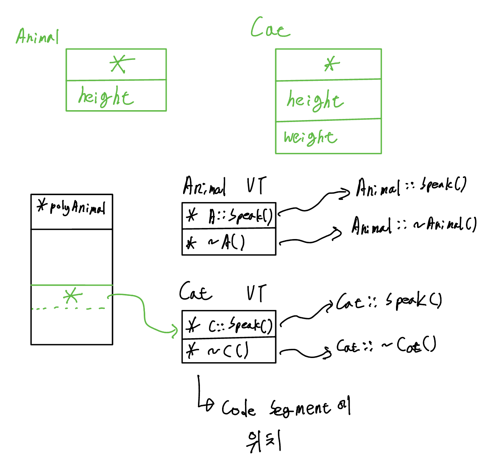

<br>

## 4. Pure Virtual Function

### Pure Virtual Function
> function implementation 이 없는 virtual function 
- object 생성이 불가능함

```cpp
#include <iostream>
using namespace std;

class Animal
{
public:
  virtual void speak() = 0;
  virtual ~Animal()=default;
private:
  double height; // 8bytes
};

class Cat : public Animal
{
public: 
  /* 🚨 unimplemented pure virtual method 'speak' in 'Cat' */
  // void speak() override
  // {
  //   cout << "meow~" << endl;
  // }
private:
  double weight; // 8bytes + 8bytes
};
 
int main() {
  Cat cat;
}
```

### Abstract class
> Pure Virtual Function을 1개라도 갖고있는 class

### Interface class
> implementation X, only pure virtual function
> member variable X

- 구현부가 있으면 추후 derived class에 원하지 않는 구현부가 상속될 수 있음
  - 원하지 않는 구현부가 절달될 때 virtual, override 키워드를 붙여 override하도록 수정해야함
- member varible이 있으면 불필요한 member varible들이 상속될 수 있음

<br>

- derived class에서 중복이 되는 메소드가 있을 때는 Interface class와 Implementation class를 구현해 다중상속을 통해 해결 


<br>

## 5. Multiple Inheritance

### linear inheritance
> base class가 1개만 있는 상속

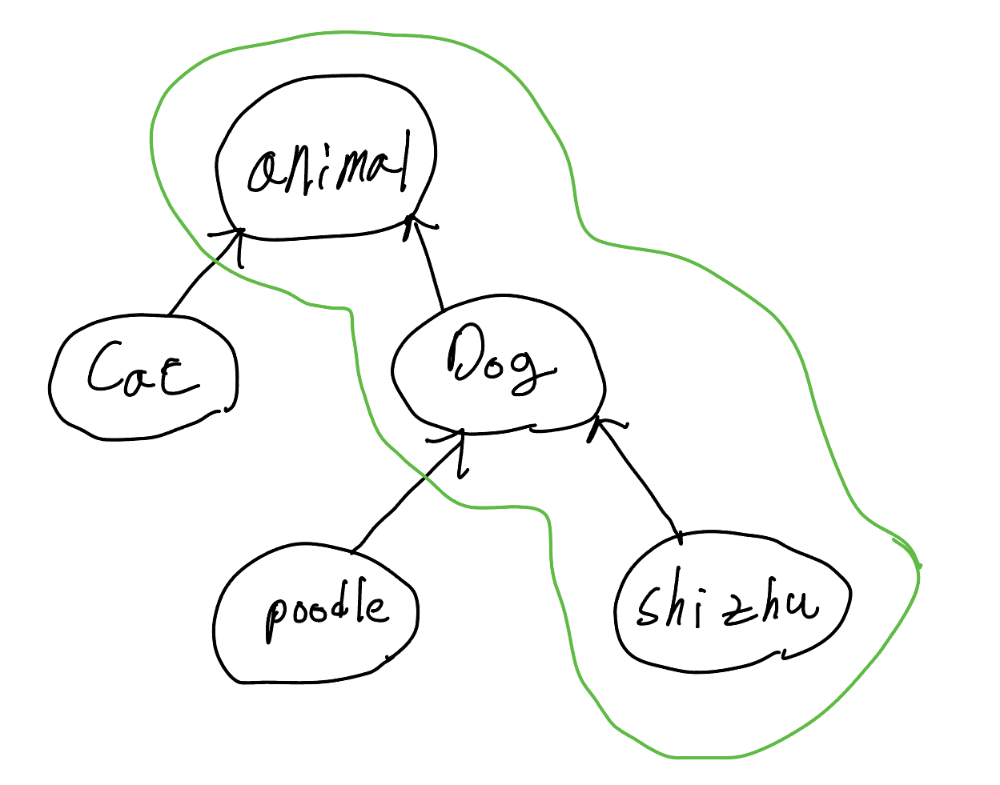  

### polymorphism

```cpp
class Animal
{
public:
  virtual void speak();
  virtual ~Animal() = default;
private:
  double animalData;
};

class Lion : public Animal
{
public:
  void speak() override;
private:
  double lionData;
};

int main(void) { 
  Animal * polyAnimal = new Lion();
  delete polyAnimal;
}
```

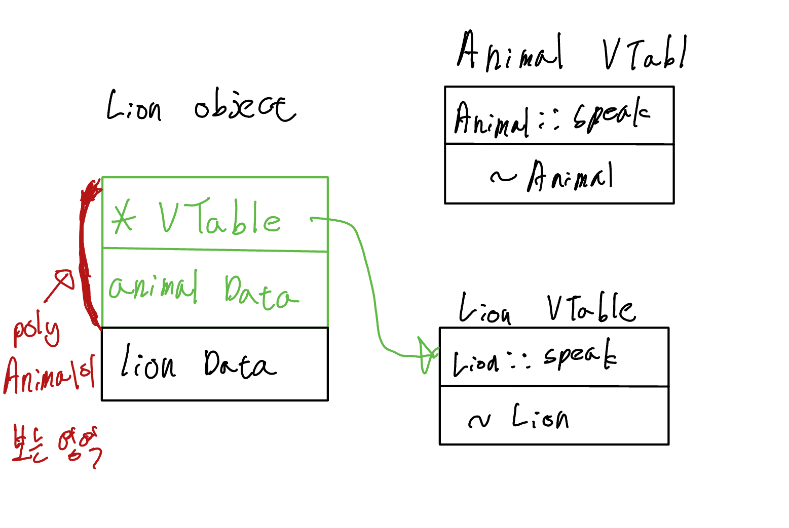

### multiple inheritance

```cpp
#include <iostream>
using namespace std;

class Lion
{
public:
  Lion() 
  {
     cout << "Lion constructor" << endl;
  }
  virtual void speak()
  {
    cout << "Lion!" << endl;
  }  
  virtual ~Lion()
  {
    cout << "Lion destructor" << endl;
  }
private:
  double lionData;
};

class Tiger
{
public: 
  Tiger() 
  {
    cout << "Tiger constructor" << endl;
  }
  virtual void speak()
  {
    cout << "Tiger!" << endl;
  }  
  virtual ~Tiger()
  {
    cout << "Tiger destructor" << endl;
  }
private:
  double tigerData;
};

class Liger : public Tiger, public Lion
{
public:
  Liger()
  {
    cout << "Liger constructor" << endl;
  }
  void speak() override
  {
    cout << "Liger!" << endl;
  }  
  virtual ~Liger() 
  {
    cout << "Liger destructor" << endl;
  }
private:
  double tigerData;
};

int main(void) { 
  Liger liger;
  liger.speak();
  return 0;
}

/*
Tiger constructor  <-- 상속 순서가 실행 순서 결정 
Lion constructor   <--
Liger constructor
Liger!
Liger destructor
Lion destructor
Tiger destructor
*/
```

<br>

```cpp
cout << sizeof(Liger) << endl;

/*
40
*/
```

```cpp
int main(void) { 
  Liger* polyLiger = new Liger();  
  polyLiger -> speak();
  delete polyLiger;
  return 0;
}
/*
Tiger constructor
Lion constructor
Liger constructor
Liger!
Liger destructor
Lion destructor
Tiger destructor
*/
```

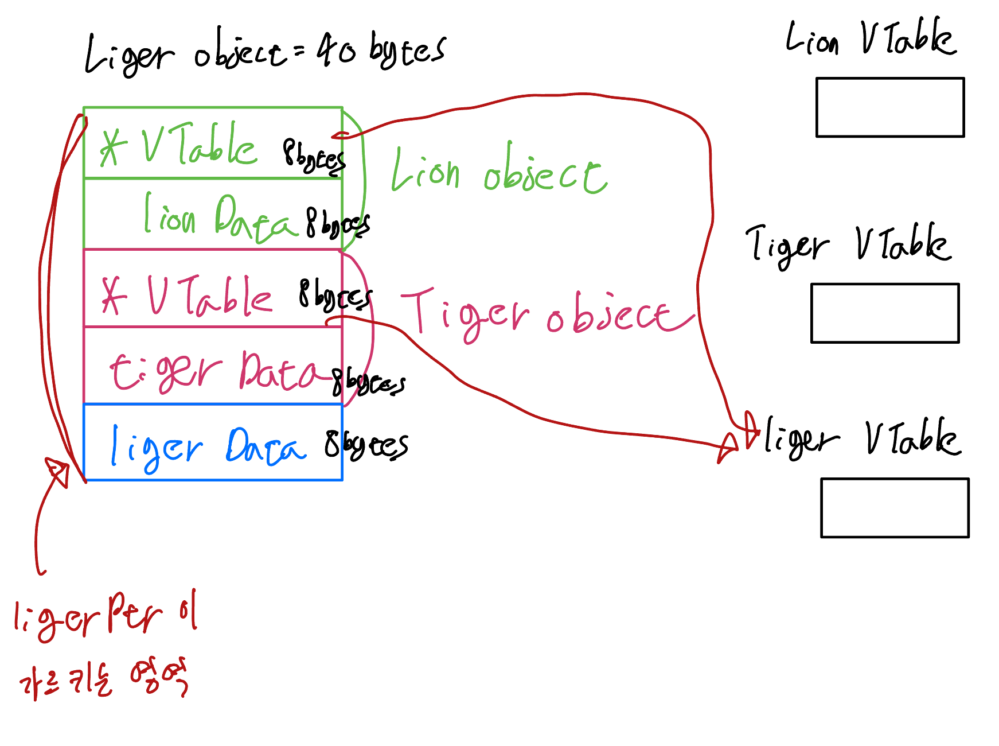

### diamond inheritance 


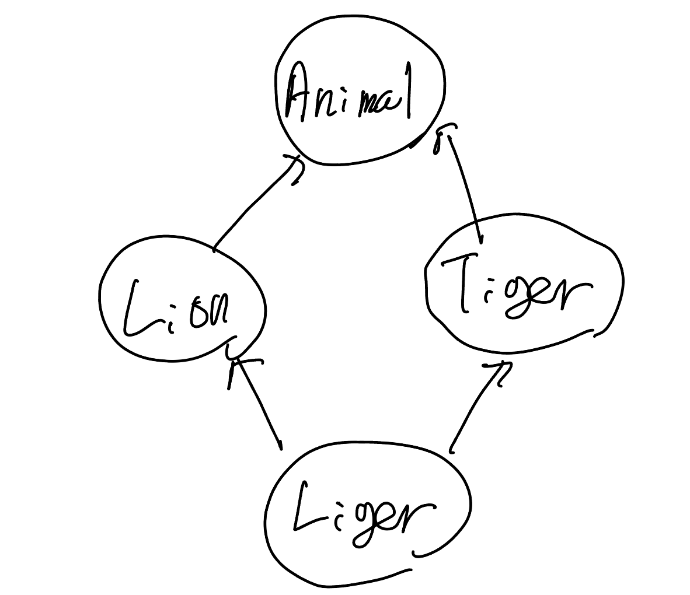

```cpp
#include <iostream>
using namespace std;

class Animal
{
public: 
  Animal()
  { 
    cout << "Animal constructor" << endl;
  }
  virtual void speak()
  {
    cout << "Animal" << endl;
  }
  virtual ~Animal()
  {
    cout << "Animal destructor" << endl;
  }
private:
  double animalData;
};

// class Lion : virtual public Animal
class Lion : public Animal
{
public:
  Lion() 
  {
     cout << "Lion constructor" << endl;
  }
  virtual void speak()
  {
    cout << "Lion!" << endl;
  }  
  virtual ~Lion()
  {
    cout << "Lion destructor" << endl;
  }
private:
  double lionData;
};

// class Tiger : virtual public Animal
class Tiger: public Animal
{
public: 
  Tiger() 
  {
    cout << "Tiger constructor" << endl;
  }
  virtual void speak()
  {
    cout << "Tiger!" << endl;
  }  
  virtual ~Tiger()
  {
    cout << "Tiger destructor" << endl;
  }
private:
  double tigerData;
};

class Liger : public Tiger, public Lion
{
public:
  Liger()
  {
    cout << "Liger constructor" << endl;
  }
  void speak() override
  {
    cout << "Liger!" << endl;
  }  
  virtual ~Liger() 
  {
    cout << "Liger destructor" << endl;
  }
private:
  double tigerData;
};

int main(void) { 
  Liger* polyLiger = new Liger();  
  polyLiger -> speak();
  delete polyLiger;
  return 0;
}
/*
Animal constructor  // 🚨 2번 실행됨
Tiger constructor   
Animal constructor  // 🚨 2번 실행됨
Lion constructor
Liger constructor
Liger!
Liger destructor
Lion destructor
Animal destructor // 🚨 2번 실행됨
Tiger destructor  
Animal destructor // 🚨 2번 실행됨
*/
```

```cpp
// .
// .
// .
class Lion : virtual public Animal
// .
// .
// .
class Tiger : virtual public Animal
/*
Animal constructor // 🚨 1번 실행됨
Tiger constructor
Lion constructor
Liger constructor
Liger!
Liger destructor
Lion destructor
Tiger destructor
Animal destructor // 🚨 1번 실행됨
*/
```

Animal을 상속받을 때 virtual 키워드를 사용하면 Animal constructor/destructor 2번실행 방지!

<br>

## 6. Virtual Inheritance

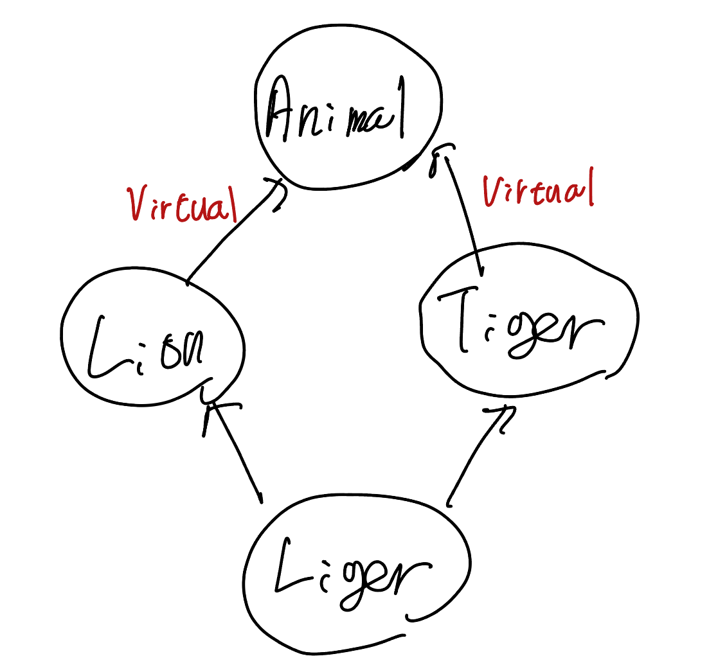

```cpp
#include <iostream>
using namespace std;

class Animal
{
public:
  virtual void speak();
  virtual ~Animal() = default;
private:
  double animalData;
};

class Lion: public Animal
{
public:
  virtual void speak();

private:
  double lionData;
};

int main(void)
{ 
  cout << sizeof(Lion) << endl;
  return 0;
}
/*
24
*/
```

### public 상속
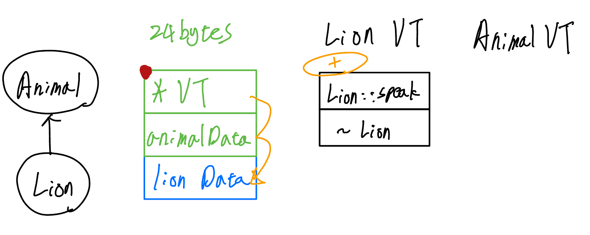
- speak function이 lionData를 사용하는 경우 object의 시작점에서 2칸 떨어져 있다는 것을 알아 접근할 수 있다.

<br>

### virtual public 상속
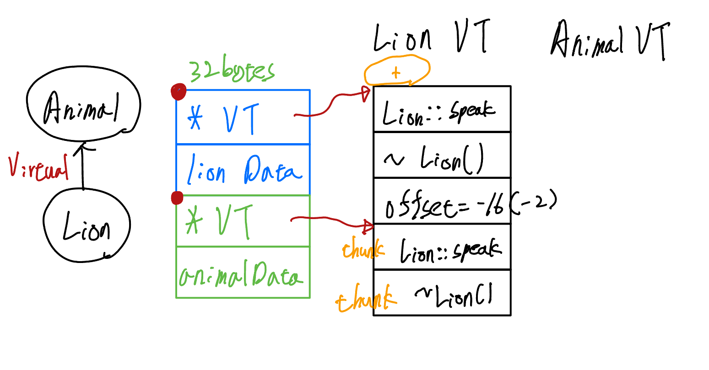

- public 상속과 다르게 *VT 한칸 더 차지한다.
- speak function이 lionData를 사용하는 경우 lionData가 어디 있는지 알 수 없다.
  - offset을 사용해서 Lion object의 시작 지점에 접근해 lionData 사용
  - `thunk` 를 사용해 offset을 사용해 함수호출하도록 명시
  - Lion의 *VT는 `thunk`를 사용하면 offset처리가돼 이상한 곳을 가르키게돼 Lion의 *VT는 `thunk` 가 없는 메소드들 가르키도록 한다.
- Animal을 상속받는 class가 Lion이 될 수도 있고 Tiger가 될 수도 있음, LionData에 해당하는 부분의 크기가 동적으로 달라질 수 있어 offset을 통해 관리

<br>

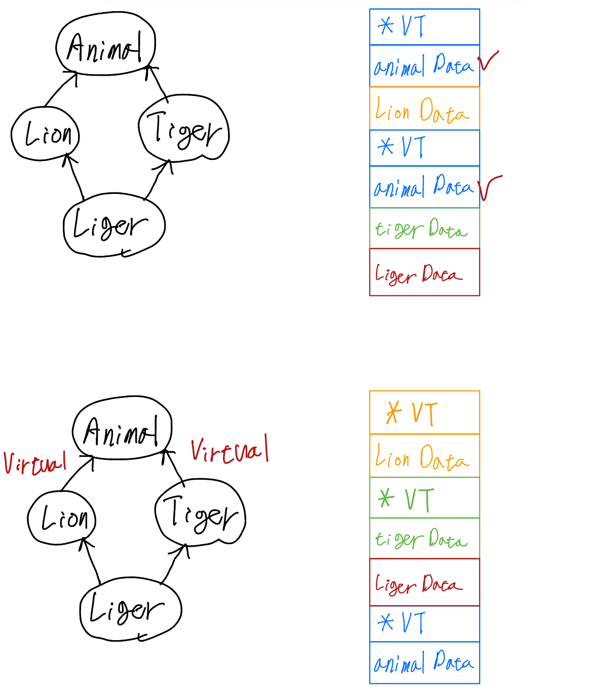

- virtual을 사용하지 않으면 animalData가 2개 생겨 어떤 Data가 맞는 데이터인지 보장할 수 없는 상황발생

<br>

## 7. Dynamic Cast
- RTTI(Run-Time Type Information)
  > https://google.github.io/styleguide/cppguide.html#Run-Time_Type_Information__RTTI_
  - Dynamic Cast 사용 금지
  - typeid 사용 금지    

### down / up cast
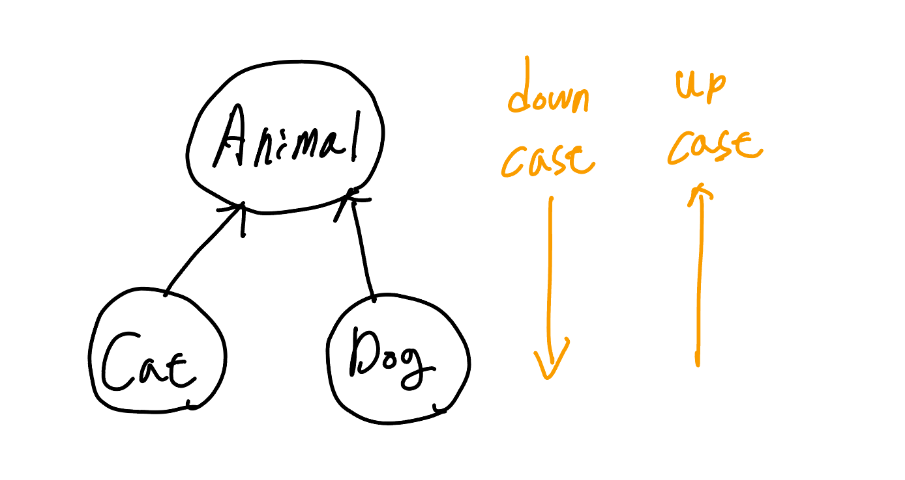

<br>

```cpp
#include <iostream>
using namespace std;

class Animal
{
public:
	virtual void speak()
	{
		std::cout << "animal" << std::endl;
	}
	virtual ~Animal() = default;
private:
	double animalData;
};

class Cat : public Animal
{
public:
	void speak() override
	{
		std::cout << "meow~" << std::endl;
	}
	void knead()
	{
		std::cout << "kkuk kkuk" << std::endl;
	}
private:
	double catData;
};

class Dog : public Animal
{
public:
	void speak() override
	{
		std::cout << "bark!" << std::endl;
	}
	void wagTail()
	{
		std::cout << "wagging" << std::endl;
	}
private:
	double dogData;
};
```

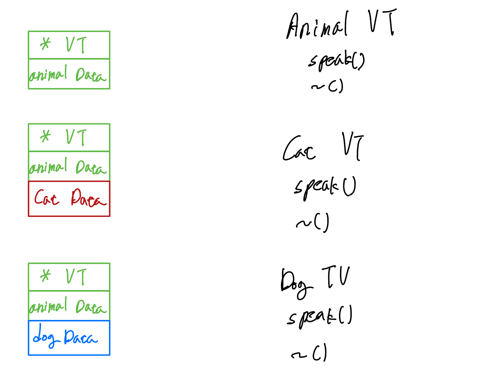

<br>

- upcast
> upcast는 더 작은 메모리 영역으로 casting해 문제발생 X
```cpp
int main()
{
	// prefer smartPtr
  Cat * catPtr = new Cat();

  // upcast
  Animal * animalPtr = catPtr;
  animalPtr->speak();
  // animalPtr->knead(); 🚨 사용불가
  delete animalPtr;
	return 0;
}
/*
meow~
*/
```
```cpp
int main()
{
	// prefer smartPtr
  Cat * catPtr = new Cat();

  // upcast
  Animal * animalPtr = static_cast<Animal *>(catPtr);
  animalPtr->speak();
  // animalPtr->knead();
  delete animalPtr;
	return 0;
}
/*
meow~
*/
```

- down cast
```cpp
int main()
{
	// downcast (base * -> derived *)
  Animal * animalPtr = new Cat();
  // implicit downcast 
  // 🚨 compile 오류 발생!
  // error: cannot initialize a variable of type 'Cat *' with an lvalue of type 'Animal *'
  Cat* catPtr = animalPtr;
  catPtr -> speak();
  catPtr -> knead();
  delete catPtr;
  return 0;
}
```
```cpp
int main()
{
	// downcast (base * -> derived *)
  Animal * animalPtr = new Cat();
  // VERY DANGEROUS
  Cat* catPtr = static_cast<Cat*>(animalPtr);
  catPtr -> speak();
  catPtr -> knead();
  delete catPtr;
  return 0;
}
```

```cpp
int main()
{
	// downcast (base * -> derived *)
  Animal * animalPtr = new Dog();
  // VERY DANGEROUS
  Cat* catPtr = static_cast<Cat*>(animalPtr);
  catPtr -> speak();
  catPtr -> knead();
  delete catPtr;
  return 0;
}
/*
bark!       // 🚨 Dog
kkuk kkuk   // 🚨 Cat
*/
```

- 존재하지 않는 memory에 access해 프로그램이 터지거나 이상한 동작을할 수 있다.

```cpp
int main()
{
	// downcast (base * -> derived *)
  Animal * animalPtr = new Dog();
  // VERY DANGEROUS
  Cat* catPtr = dynamic_cast<Cat*>(animalPtr);
  if(catPtr == nullptr) 
  {
    cout << "This is not a cat object" << endl;
    return 0;
  }
  catPtr -> speak();
  delete catPtr;
  return 0;
}
/*
This is not a cat object
*/
```
- dynamic cast를 통해 안전하게 down casting 가능
- type info 가 다르면 nullptr 반환
- type info는 virtual table안에 존재
> [cpp reference type info](https://en.cppreference.com/w/cpp/types/type_info)
> [cpp reference dynamic cast](https://en.cppreference.com/w/cpp/language/dynamic_cast)

```cpp
int main()
{
  cout << typeid(Animal).name() << endl;
  cout << typeid(Cat).name() << endl;
  cout << typeid(Dog).name() << endl;
}
/*
6Animal
3Cat
3Dog
*/
```

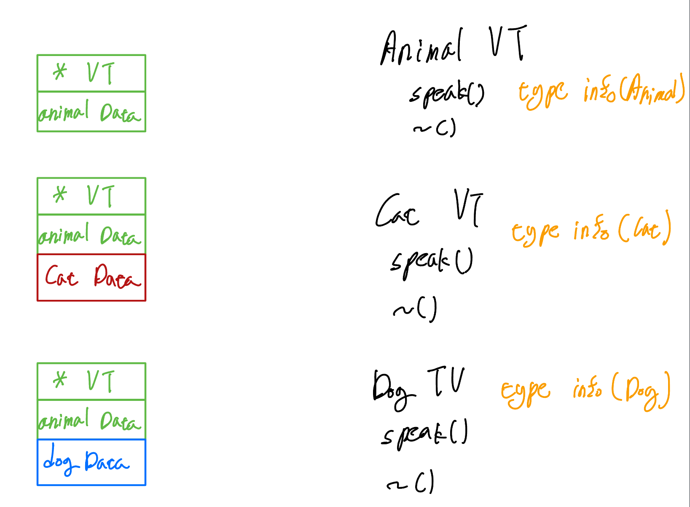

<br>

## 8. Object Slicing

```cpp
#include <iostream>
using namespace std;

class Animal 
{
public: 
  virtual void speak()
  {
    cout << "Animal" << endl;
  }
  virtual ~Animal() = default;

private:
  double animalData = 0.0;
};

class Cat : public Animal
{
public:
  Cat(double d): catData{d} { ;}
  void speak() override
  {
    cout << "meow~" << endl;
  }
private:
  double catData;
};

int main(void)
{ 
  Cat kitty{1.0};

  Animal& animalRef = kitty;
  animalRef.speak();

  cout << "-----------------------------" << endl;

  Animal animalObj = kitty; // copy constructor
  animalObj.speak();

  return 0;
}
```

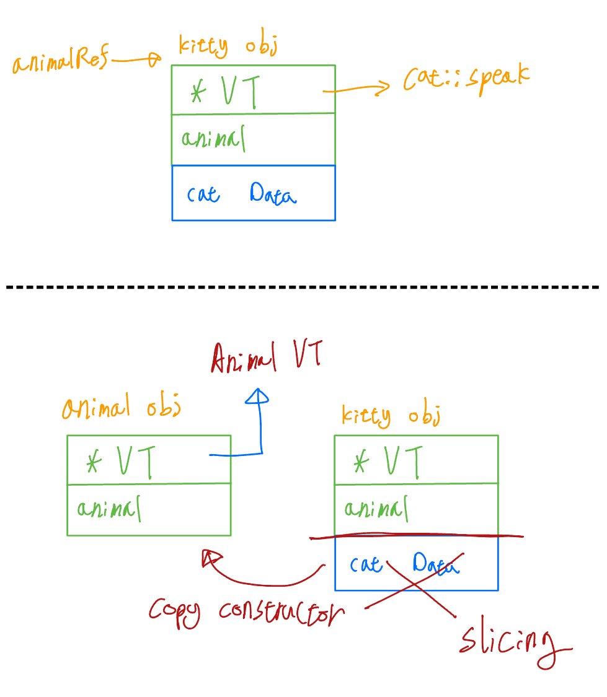

- animalObj를 copy constructor를 통해 생성하는 과정에서 catData 부분이 slicing되고 *VT는 일반적인 멤버변수여서 copy가 발생하지 않고 Animal VT를 가르키게된다.

```cpp
void f(Animal animal) { 
  animal.speak();
}
```

- Animal을 reference로 전달 받지않고 value로 전달받게 되면 object slicing 발생


### Copy Constructor를 delete 처리

```cpp
class Animal 
{
public: 
  Animal(const Animal & other) = delete;
  Animal& operator=(Animal other) = delete;
}

...

/*
error: call to deleted constructor of 'Animal'
*/
```

- copy constructor, copy assignmnet delete처리

```cpp
int main(void)
{ 
  Cat kitty{1.0};
  Cat nabi{kitty};
}
/*
error: call to implicitly-deleted copy constructor of 'Cat'
*/
```

- derived class 끼리의 copy constructor 도 delete 처리된다.

### Copy Constructor를 protected로 이동

```cpp
class Animal 
{
public: 
  Animal()=default;
  Animal& operator=(Animal other) = delete;
  virtual void speak()
  {
    cout << "Animal" << endl;
  }
  virtual ~Animal() = default;
protected:
  Animal(const Animal & other) = default;

private:
  double animalData = 0.0;
};
```

- derived class가 copy constructor를 호출할 때 protected 안에 있는 base class 에 접근해 호출할 수 있다.

### Base Class를 순수 Abstract Class로 유지

- operator overloading 문제도 해결


<br>

## 9. I/O Inheritance

> [Stream-based I/O](https://en.cppreference.com/w/cpp/io)

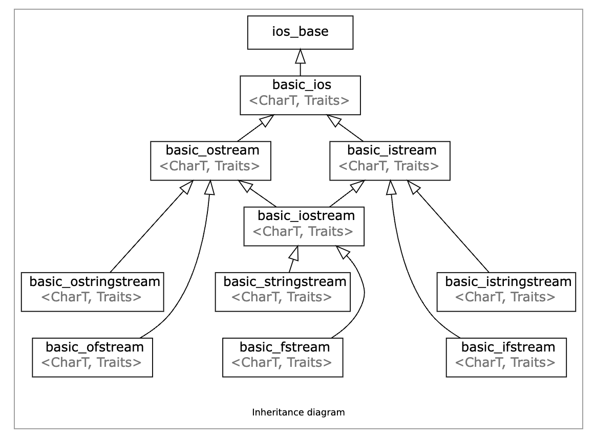

```cpp
#include <iostream>
#include <string>
using namespace std;

class Cat 
{ 
public:
  Cat(string name, int age) : mName{std::move(name)}, mAge{age} {};
  void print(std::ostream & os)
  { 
    os << mName << "," << mAge << '\n';
  }
  void setFromStream(istream &is) 
  {

  }
private:
  string mName;
  int mAge;
};

int main() 
{
  Cat kitty{"kitty", 3};
  Cat nabi{"nabi", 2};

  kitty.print(cout);
  kitty.print(cout);
  return 0;
}
```
